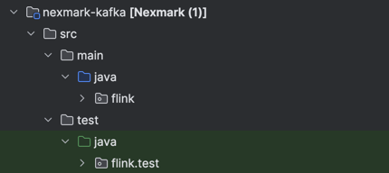

# Updates

## Queries

- **Query 4** Arkash is working on this query
- **Query 6** Arkash worked on this query
- **Query 7** Arkash worked on this query
- **Query 2** We are ignoring this query since its stateless

## Tasks

- **Experimental** - We are working on porting over existing experimental code from the old group.
- **Finalizing Queries** - Query 7 runs, we are working on fixing the logic for Query 4 and 7.
- **Clarification** - It was mentioned we need Kafka to store the source data so that Kafka can ensure sending data in a
  fixed order.

## Docs for Query4

*Started Feb 18, 2024*
**Query 4**:

Average Price for a Category
Select the average of the wining bid prices for all auctions in each category.
Illustrates complex join and aggregation.

```sql
CREATE TABLE nexmark_q4
(
    id    BIGINT,
    final BIGINT
) WITH (
      'connector' = 'blackhole'
      );

INSERT INTO nexmark_q4
SELECT Q.category,
       AVG(Q.final)
FROM (SELECT MAX(B.price) AS final, A.category
      FROM auction A,
           bid B
      WHERE A.id = B.auction
        AND B.dateTime BETWEEN A.dateTime AND A.expires
      GROUP BY A.id, A.category) Q
GROUP BY Q.category;
```

*Updated April 2024*

### Key Imports & Libraries, Program Logic

**Added Imports**
Import keyed streams, data streams, and process functions for watermarks.

```java
import org.apache.flink.streaming.api.TimeCharacteristic;
import org.apache.flink.streaming.api.CheckpointingMode;
import org.apache.flink.streaming.api.datastream.DataStream;
import org.apache.flink.streaming.api.datastream.KeyedStream;
import org.apache.flink.streaming.api.environment.StreamExecutionEnvironment;
import org.apache.flink.streaming.api.functions.KeyedProcessFunction;
import org.apache.flink.streaming.api.functions.co.CoProcessFunction;
```

**Logger & Constants**

```java
// logic to read input parameter for ratelist add more variables if needed input format would be query followed by --ratelist 5000_3000 ..
// The code below will separate the numbers, store them as an array and then print them out as a string for verification
private static final Logger logger = LoggerFactory.getLogger(Query4Stateful.class);
final ParameterTool params = ParameterTool.fromArgs(args);
```
**Documentation**

1) looking
   at https://github.com/apache/beam/tree/master/sdks/java/testing/nexmark/src/main/java/org/apache/beam/sdk/nexmark/model
   for reference
2) Auction
   Logic -  https://github.com/apache/beam/blob/master/sdks/java/testing/nexmark/src/main/java/org/apache/beam/sdk/nexmark/model/Auction.java#L12
3) Ensure that you dont use slot sharing group names here

```java
DataStream<Bid> bids = env.addSource(new BidSourceFunction(bidSrcRates))
        .name("SourceBids")
        .setParallelism(params.getInt("psb", 1));
```

Slot groups are for sharing resources. Basically the idea here is that we have bids that may come in after the auctions. However if we are computing ad-hoc, it
will give incorrect results. Therefore, we need to ensure that watermarks are used.

5) Clear state once watermark is recorded
   The logic behind the onTimer is so that we have a trigger that is run on the expiration time when we clean up the
   state.


## Docs for Query 6

Query 6: Average Selling Price by Seller

```sql
 SELECT Istream(AVG(Q.final), Q.seller)
 FROM (SELECT Rstream(MAX(B.price) AS final, A.seller)
       FROM Auction A [ROWS UNBOUNDED], Bid B [ROWS UNBOUNDED]
       WHERE A.id=B.auction AND B.datetime < A.expires AND A.expires < CURRENT_TIME
       GROUP BY A.id, A.seller) [PARTITION BY A.seller ROWS 10] Q
 GROUP BY Q.seller;
```

1) **Initial Setup**:
   Similar to query 4, we will read from Kafka sources and keyBy auction id.

```java

KeyedStream<Auction, Long> keyedAuctions = auctions
        .keyBy(
                new KeySelector<Auction, Long>() {
                    @Override
                    public Long getKey(Auction auction) throws Exception {
                        return auction.id;
                    }
                }
        );

KeyedStream<Bid, Long> keyedBids = bids
        .keyBy(new KeySelector<Bid, Long>() {
            @Override
            public Long getKey(Bid bid) throws Exception {
                return bid.auction;
            }
        });
```

2) **Process Function**:
   In the *JoinBidsWithAuctions* function, we need to get a ValueState for auctionSeller this time. The emitted tuples
   will have the
   auction id, bid price, end time, and seller id.

```java
private ValueState<Long> auctionEndTime;
// bufferedBids is a list of bids that arrived before the auction, use ListState
private ListState<Bid> bufferedBids;
private ValueState<Long> auctionSeller;
```

Return

```java
//<bid.auction, bid.price, endTime, seller>
out.collect(new Tuple4<>(bid.auction, bid.price, endTime, seller));
```

Then Calculate the maximum bid, similar to query 4 but this time using the seller id for the average selling price.

Finally run an aggregate function with accumulator and combine functions to calculate the average selling price.

```java
//...
@Override
public Tuple3<Long, Long, Long> add(Tuple4<Long, Long, Long, Long> value, Tuple3<Long, Long, Long> accumulator) {
    return Tuple3.of(accumulator.f0 + value.f1, accumulator.f1 + 1, value.f3);
}

// Calculate the average price
@Override
public Tuple2<Long, Double> getResult(Tuple3<Long, Long, Long> accumulator) {
// Calculate average
    return Tuple2.of(accumulator.f2, accumulator.f0.doubleValue() / accumulator.f1);
}
```

3) Using a tumbling window

Key by the seller id and use a tumbling window of 10 seconds.

```java
.keyBy(new KeySelector<Tuple4<Long, Long, Long, Long>, Long>() {
    @Override
    public Long getKey (Tuple4 < Long, Long, Long, Long > value) throws Exception {
        return value.f3;
    }
})
        .

window(TumblingEventTimeWindows.of(Time.seconds(10)))
```

## Query 7

Query 7: Average Selling Price by Seller

Query 7 monitors the highest price items currently on auction. Every ten minutes, this query returns the
highest bid (and associated itemid) in the most re- cent ten minutes. This query uses a time-based,
fixed- window group by.

```sql
Query
7: Highest Bid
SELECT Rstream(B.auction, B.price, B.bidder)
FROM Bid [RANGE 1 MINUTE SLIDE 1 MINUTE] B
WHERE B.price = (SELECT MAX (B1.price)
    FROM BID [RANGE 1 MINUTE SLIDE 1 MINUTE] B1);
```

Run a tumbling window, find the highest bid in the window, and output the auction id, price, and bidder.

```java
SingleOutputStreamOperator<Tuple3<Long, Long, Long>> highestBid = bids
        .keyBy(
                (Bid bid) -> bid.auction
        )
        .window(TumblingEventTimeWindows.of(Time.minutes(1)))
        .reduce(new ReduceFunction<Bid>() {
            @Override
            public Bid reduce(Bid b1, Bid b2) {
                return b1.price > b2.price ? b1 : b2;
            }
        }, new ProcessWindowFunction<Bid, Tuple3<Long, Long, Long>, Long, TimeWindow>() {
            @Override
            public void process(Long key, Context context, Iterable<Bid> elements, Collector<Tuple3<Long, Long, Long>> out) {
                Bid highestBid = elements.iterator().next();
                out.collect(new Tuple3<>(highestBid.auction, highestBid.price, highestBid.bidder));
            }
        });
```

## Testing

Each of the queries has test classes written under Nexmark Kafka. I have generated wrapper classes for queries 4, 6 and
7 which call the function logic and generated sample data using the utils classes given to me. Assert functions verify
the logic for what has been done.
When you run ```mnv clean package```, it generates the .jar files for the tests which can be simply run on the flink
cluster.

### Query 4

```java
private void verifyAveragePriceCalculations(List<Tuple3<Long, Long, Double>> results) {
// Assume we know the expected averages for categories based on test input data
    Map<Long, Double> expectedAverages = new HashMap<>();
    expectedAverages.put(1L, 25.0);  // Expected average for category 1
    expectedAverages.put(2L, 45.0);  // Expected average for category 2

// Check if all expected categories are present and their averages are correct
    for (Tuple3<Long, Long, Double> result : results) {
        Long categoryId = result.f0;
        Double calculatedAverage = result.f2;
        Assert.assertTrue("Category ID " + categoryId + " is unexpected", expectedAverages.containsKey(categoryId));
        Assert.assertEquals("Incorrect average calculated for category " + categoryId,
                expectedAverages.get(categoryId), calculatedAverage, 0.01);
    }

// Optionally, check that all expected categories were tested
    Assert.assertEquals("Some expected categories were not processed", expectedAverages.size(), results.size());
}
```

### Query 6
Same as Query 4, we generate sample data and then verify the results.
```java
// Sample

DataStream<Bid> bids = env.fromElements(
        new Bid(1, 1, 20, System.currentTimeMillis(), ""),
        new Bid(1, 2, 30, System.currentTimeMillis(), ""),
        new Bid(2, 1, 40, System.currentTimeMillis(), ""),
        new Bid(2, 2, 50, System.currentTimeMillis(), ""),
        new Bid(3, 1, 60, System.currentTimeMillis(), ""),
        new Bid(3, 2, 70, System.currentTimeMillis(), ""),
        new Bid(4, 1, 80, System.currentTimeMillis(), ""),
        new Bid(4, 2, 90, System.currentTimeMillis(), ""),
        new Bid(20, 1, 200, System.currentTimeMillis(), ""),
        new Bid(20, 2, 300, System.currentTimeMillis(), ""),
        new Bid(100, 1, 1000, System.currentTimeMillis(), ""),
        new Bid(100, 2, 2000, System.currentTimeMillis(), ""),
        new Bid(200, 1, 2000, System.currentTimeMillis(), ""),
        new Bid(200, 2, 3000, System.currentTimeMillis(), ""),
        new Bid(300, 1, 3000, System.currentTimeMillis(), ""),
        new Bid(300, 2, 4000, System.currentTimeMillis(), ""),
// add random bids to test validity of the function
        new Bid(5, 1, 500, System.currentTimeMillis(), ""),
        new Bid(5, 2, 600, System.currentTimeMillis(), ""),
        new Bid(6, 1, 700, System.currentTimeMillis(), ""),
        new Bid(6, 2, 800, System.currentTimeMillis(), "")
);

DataStream<Tuple2<Long, String>> bidders = env.fromElements(
        new Tuple2<>(1L, "Alice"),
        new Tuple2<>(2L, "Bob"),
        new Tuple2<>(3L, "Charlie"),
        new Tuple2<>(4L, "David"),
        new Tuple2<>(5L, "Eve"),
        new Tuple2<>(6L, "Frank")
);

// verify the results
private void verifyResult(List<Tuple2<Long, Double>> results) {
    // verify the results
    Assert.assertEquals(6, results.size());
    Assert.assertEquals(new Tuple2<>(1L, 1000.0), results.get(0));
    Assert.assertEquals(new Tuple2<>(2L, 2000.0), results.get(1));
    Assert.assertEquals(new Tuple2<>(3L, 3000.0), results.get(2));
    Assert.assertEquals(new Tuple2<>(4L, 4000.0), results.get(3));
    Assert.assertEquals(new Tuple2<>(5L, 550.0), results.get(4));
    Assert.assertEquals(new Tuple2<>(6L, 750.0), results.get(5));
}
``` 

### Query 7
Generate sample lists, assign timestamps and watermarks, and then generate the stream with a tumbling window. The
expected output is then compared with the result.

Use the collectAndExecute function to run the tests.
```java

@Test
public void testHighestBidCalculation() throws Exception {
    StreamExecutionEnvironment env = StreamExecutionEnvironment.getExecutionEnvironment();
    env.setParallelism(1);
    env.getConfig().setAutoWatermarkInterval(1000);

    List<Bid> bids = new ArrayList<>();
    bids.add(new Bid(1, 1, 10, System.currentTimeMillis(), ""));
    bids.add(new Bid(1, 2, 20, System.currentTimeMillis(), ""));
    bids.add(new Bid(1, 3, 30, System.currentTimeMillis(), ""));
    bids.add(new Bid(1, 4, 40, System.currentTimeMillis() + 1000, ""));
    bids.add(new Bid(1, 5, 50, System.currentTimeMillis() + 1500, ""));
    bids.add(new Bid(1, 6, 60, System.currentTimeMillis() + 750, ""));
    bids.add(new Bid(2, 2, 20, System.currentTimeMillis() + 1000, ""));
    bids.add(new Bid(2, 3, 30, System.currentTimeMillis() + 750, ""));
    bids.add(new Bid(2, 4, 40, System.currentTimeMillis() + 1500, ""));

    DataStream<Bid> bidDataStream = env.fromCollection(bids)
            .assignTimestampsAndWatermarks(WatermarkStrategy.<Bid>forBoundedOutOfOrderness(Duration.ofSeconds(10))
                    .withTimestampAssigner((bid, timestamp) -> bid.dateTime));

    DataStream<Tuple3<Long, Long, Long>> highestBids = Query7.generateStreamWithTumblingWindow(bidDataStream);

    List<Tuple3<Long, Long, Long>> expectedOutput = new ArrayList<>();
    expectedOutput.add(new Tuple3<>(1L, 6L, 60L));
    expectedOutput.add(new Tuple3<>(2L, 4L, 40L));

    List<Tuple3<Long, Long, Long>> result = highestBids.executeAndCollect(2);
    Assert.assertEquals(expectedOutput, result);
}
```

### Query 3

**[fixing code written by previous team]**

```java
SELECT Istream(P.name, P.city, P.state, A.id)
FROM Auction A [ROWS UNBOUNDED], Person P [ROWS UNBOUNDED]
WHERE A.seller = P.id AND (P.state = `OR' OR P.state = `ID' OR P.state = `CA') AND A.category = 10;
```

The code joins the auction and person streams and emits the name, city, state, and auction id if the person is from OR,
ID, or CA and the auction category is 10.
The personState and auctionState are used to store the latest Person and Auction objects, respectively. The flatMap1
function updates the auctionState with the latest Auction object and emits the result if the conditions are satisfied.
The flatMap2 function updates the personState with the latest Person object.

```java
 private static class JoinAuctionWithPerson extends RichCoFlatMapFunction<Auction, Person, Tuple4<String, String, String, Long>> {
    // IMPORTANT: USE ValueState Functions  
    // State to hold the latest Person object
        private ValueState<Person> personState;
        // State to hold the latest Auction object
        private ValueState<Auction> auctionState;
//....
        
// filter the results by the category and see if the person is null or not
if (person != null && auction.category == 10) {
if (person.state != null) {
if (person.state.equals("OR") || person.state.equals("ID") || person.state.equals("CA")){ //.. 
```

### Query 5
- Fixed the logic for this query
```sql
SELECT Rstream(auction)
FROM (SELECT B1.auction, count(*) AS num
      FROM Bid [RANGE 60 MINUTE SLIDE 1 MINUTE] B1
      GROUP BY B1.auction)
WHERE num >= ALL (SELECT count(*)
                  FROM Bid [RANGE 60 MINUTE SLIDE 1 MINUTE] B2
GROUP BY B2.auction);
```
Collect output from the Bid stream, count the number of bids for each auction in a 60-minute window, and output the 
auction if the number of bids is greater than or equal to the maximum number of bids for any auction in the window.
Use an aggregate function to count the number of bids for each auction in the window and a process function to output
```java
SingleOutputStreamOperator<String> auctionCount = keyedBids.window(SlidingEventTimeWindows.of(Time.hours(1), Time.minutes(1)))
.aggregate(
        // Count the number of bids per auction
        new BidCountAggregate()
        // Output the auction with the highest number of bids
        , new AuctionWindowFunction());
```


### Mistakes to Avoid

1) Please avoid the use of AI, my teammates tried using it on my queries and ended by breaking the code.
2) For the purposes of checkpointing, we do not need a **ratelist parameter or slotGroups**.
3) Ensure that you are using watermarks for out of order data and using process, coProcess, KeyedProcessFunction, and
   CoProcessFunction for stateful operations.
4) Override all methods in the process function, and ensure that you are using the correct imports.
5) Do not use MapState functions in DataStream operations since you are passing in KeyedStreams. You will have existing
   ids that will be unique.
6) Make sure to clear state from RocksDB
7) Output tuples have a set format of being indexed, I had a lot of trouble in grouping my category so instead of
   grouping the whole query, I implemented fine-grained grouping for each result. I believe most of the results should
   be
   be the same however there might be minor values lost. However the previous maintainers of this code did not provide
   me with a category relation and in the interest of time I found it best to group using the in-built category
   attribute.
8) Spend a LOT of time on the flink documentation, the source and utils classes for coding up the queries.
# Implementing Nexmark

## Introduction

* Clone the Nexmark repository from the following link:

```
git clone https://github.com/nexmark/nexmark
```

* Go to the nexmark-flink directory and run the build command:

```
cd nexmark-flink
./build.sh
```

Or you can run the following command to build the project:

```
mvn clean install
```

* Running the build command generates a ```nexmark-flink.tgz``` file.
* Extract the ```nexmark-flink.tgz``` file using the following command:

```
tar -xvzf nexmark-flink.tgz
```

* Move the nexmark/lib .jar files to the lib directory:

```
mv nexmark-flink/lib/* lib/
```

* Go to the flink bin and run the flink sql command.

(Note that I have flink in my root, adjust location accordingly)

```
cd ~
cd flink-1.13.2/bin
./sql-client.sh embedded -f ../../Desktop/Spring2024/CS551/nexmark/nexmark-flink/nexmark-flink/queries/ddl_gen.sql
```

If you simply run ./sql-client.sh, it will open the SQL CLI. Instead you need to run the embedded mode and mention the
path of the file you need to run to not open the CLI and get the desired result. The first command up here generates a
table called datagen which simply generates a table with the following tuples:
** event_type
** person
** auction
** bid
** dateTime

# Setup

1) Add the junit tests to the pom file, you may need to add more dependencies depending on the tests you are running.
   https://maven.apache.org/plugins-archives/maven-surefire-plugin-2.12.4/examples/junit.html

```xml

<dependency>
    <groupId>junit</groupId>
    <artifactId>junit</artifactId>
    <version>4.13.2</version>
    <scope>test</scope>
</dependency>
```

2) Add the queries to the pom file

```xml

<execution>
    <id>Query7</id>
    <phase>package</phase>
    <goals>
        <goal>single</goal>
    </goals>
    <configuration>
        <finalName>Query7</finalName>
        <archive>
            <manifestEntries>
                <program-class>flink.queries.Query7</program-class>
            </manifestEntries>
        </archive>
    </configuration>
</execution>
```

3)


I added the maven sunfire plugin to the pom file and then added the configuration for the queries. This plugin will find
all the test files and run them. For example, the above screenshot shows all files with Test or Tests written in them
will be executed.
You can also specify the test files you want to run by specifying the class name in the configuration. I ran
testQuery7.java
**Ensure that the relative path for the queries module is correct. Depending on how your folders are structured, you may
need to adjust the path.**

4) Ensure that you import the project as a maven project. To do so, open IntelliJ, right-click on the folder to that
   needs to have maven, and then import as a maven project.

5) Tests should be in the src folder but in a test folder

- /src
    - /main
        - /java/flink
            - /queries

    - /test
        - /java
            - /flink/test
              
              

6. Ensure that you set parallelism to 1 for the tests. This is because the tests are run on a local machine and the
   parallelism should be set to 1 to avoid any issues with the tests.

# Changes between Nexmark and Nexmark Kafka
1) **Source Functions**: The source functions for Kafka are different from the source functions for Nexmark.
   In the kafka source functions, we need to import necessary classes and implement the source functions.

```java
KafkaSource<Bid> source =
        KafkaSource.<Bid>builder()
                .setBootstrapServers(broker)
                .setGroupId(kafkaGroup)
                .setTopics(kafkaSrcTopic)
                .setDeserializer(KafkaRecordDeserializationSchema.valueOnly(new BidSchema()))
                .setProperty(KafkaSourceOptions.REGISTER_KAFKA_CONSUMER_METRICS.key(), "true")
                // If each partition has a committed offset, the offset will be consumed
                // from the committed offset.
                // Start consuming from scratch when there is no submitted offset
                .setStartingOffsets(
                        OffsetsInitializer.committedOffsets(OffsetResetStrategy.EARLIEST))
                .build();
```
2) **Sink Functions**: The sink functions for Kafka are different from the sink functions for Nexmark.
   In the kafka sink functions, we need to import necessary classes and implement the sink functions.
3) We will have to ensure that the data is serialized and then converted to a string before being sent to the Kafka topic.

# Table of Contents

1. [Introduction](#introduction)
2. [Query 4](#query-4)
3. [Query 6](#query-6)
4. [Query 7](#query-7)
5. [Query 3](#query-3)
6. [Testing](#testing)
7. [Implementing Nexmark](#implementing-nexmark)
8. [Setup](#setup)
9. [Changes between Nexmark and Nexmark Kafka](#changes-between-nexmark-and-nexmark-kafka)
   

**Note**:

1) Query 4 was started on Feb 18, 2024. In the coming 3 weeks, we were confused on how to modify the flink runtime code.
   A lot of our time was spent understanding checkpointing, existing solutions, and how to implement the queries.
2) March 12 was when I showed the first working version of Query 4 to the team.
3) The next week or so was spent fixing the logic for 4.
4) Once 4 was done, 2 weeks were spent on 6 and 7 together
5) The first week of April was spent on testing and finalizing the queries.
6) At the time of writing, in the third week of April, I am finalizing the documentation for the queries and the testing
   logic.


**Update** (April 21):

1) All queries have had additional tests added to them
2) We are testing them right now
3) Query 3's logic is broken
4) After consultation with the team, we found out that the initial logic from previous queries was flawed, just added
   kafka sinks

**Update** (April 25):
1) Queries 3 and 5 are done
2) 7 is perfect
3) 4 and 6 have been tested, 6's code has been fixed.


```bash
mvn test --am -T 4 -up -fn
```
To run quietly add a --q flag

Ensure that the pom has the firesafe plugin installed and you have the StreamExecution environment set up correctly.

2) Also make sure that you have a sink. The tests will fail if you do not have a sink.
   Ensure that you execute before collecting the results. One error you may get would be running the executeAndCollect
   code
   and then running env.execute(). It will fail because you already executed the code. Ensure the limit is set to less
   than the
   number of tuples you are collecting. In my random case i need to sort my auction ids and then collect the first 5
   tuples.

```java
DataStream<Tuple3<Long, Long, Long>> highestBids = Query7.generateStreamWithTumblingWindow(bidDataStream);
env.

execute();

List<Tuple3<Long, Long, Long>> result = highestBids.executeAndCollect(5);
result.

sort(Comparator.comparing(t ->t.f0)); // Sort by auction ID for consistent ordering
        Assert.
assertEquals(expectedOutput, result);
```
